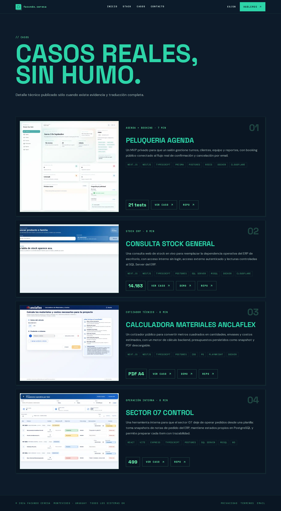
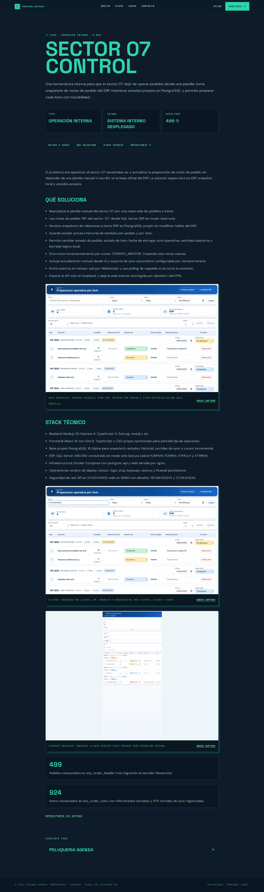
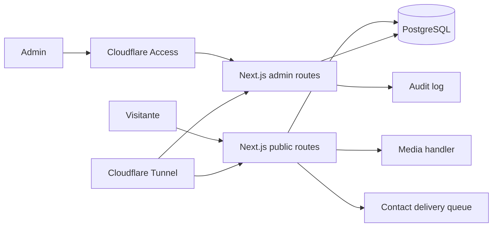

# Portfolio Facundo Ceresa

Portfolio full-stack autohospedado de Facundo Ceresa. El proyecto muestra casos reales, evidencia visual local, un panel admin protegido y una base de despliegue pensada para publicarse por Cloudflare Tunnel.

Repositorio publico: <https://github.com/facundoceresa/portfolio-facu>

## Que incluye

- Home publica con casos destacados y enlaces sociales.
- Paginas de casos con capturas locales, stack tecnico, resultados, repositorios y demos cuando existen.
- Version en espanol e ingles.
- Formulario de contacto con validacion, consentimiento, honeypot, Turnstile opcional, rate limit e idempotencia.
- Panel admin privado para proyectos, casos, medios, mensajes, ajustes y auditoria.
- CI con lint, typecheck, tests, build, e2e, accesibilidad, visual regression, CodeQL, dependency review y secret scan.

## Capturas

| Home/casos | Detalle de caso |
| --- | --- |
|  |  |

Las capturas de casos publicadas viven en `apps/web/public/work/*`. No dependen de URLs externas ni de assets remotos.

## Casos publicados

- `peluqueria-agenda`: agenda privada con roles, booking publico, mails y reportes.
- `consulta-stock-general`: consulta mobile-first de stock ERP con superficie externa y panel interno.
- `calculadora-materiales-anclaflex`: calculadora publica de materiales, costos y PDF.
- `sector07-control`: mesa operativa para preparar pedidos por item sin escribir en el ERP.

## Arquitectura



La app es un monolito Next.js con limites internos claros: rutas publicas, rutas admin, API handlers, contenido en PostgreSQL, media servida por handler y despliegue via contenedores sin publicar puertos directos al host.

## Desarrollo

```bash
corepack enable pnpm
pnpm install --frozen-lockfile
cp apps/web/.env.example apps/web/.env
pnpm --filter web db:migrate
pnpm --filter web db:seed:dev
ADMIN_EMAIL=facundo@example.com pnpm --filter web db:create-admin
pnpm dev
```

## Validación

```bash
pnpm lint
pnpm typecheck
pnpm test
pnpm build
pnpm --filter web test:e2e
pnpm --filter web test:a11y
pnpm --filter web test:visual
```

Antes de correr e2e/a11y/visual, levantar la app local:

```bash
pnpm dev
WEB_BASE_URL=http://127.0.0.1:3000 pnpm --filter web test:e2e
WEB_BASE_URL=http://127.0.0.1:3000 pnpm --filter web test:a11y
WEB_BASE_URL=http://127.0.0.1:3000 pnpm --filter web test:visual
```

## Secretos

Los archivos `.env`, `.env.*`, `secrets/`, backups, storage local, reportes y caches estan ignorados. Antes de publicar cambios:

```bash
pnpm scan:secrets:no-git
git status --ignored --short
```

En produccion, `compose.yaml` lee secretos desde archivos montados en `/run/secrets`; no se deben commitear valores reales de DB, SMTP, Turnstile, sesion, CSRF, IP hash, Cloudflare ni GitHub.

## Producción

Producción usa `compose.yaml` sin puertos publicados al host. La única entrada pública debe ser Cloudflare Tunnel. Ver `docs/operations/RUNBOOK.md`.

## Estado publico

El repo esta preparado para mostrarse como proyecto: contiene documentacion operativa, checklist de seguridad, tests automatizados, snapshots visuales, casos con evidencia local y escaneo de secretos antes de cada push relevante.
