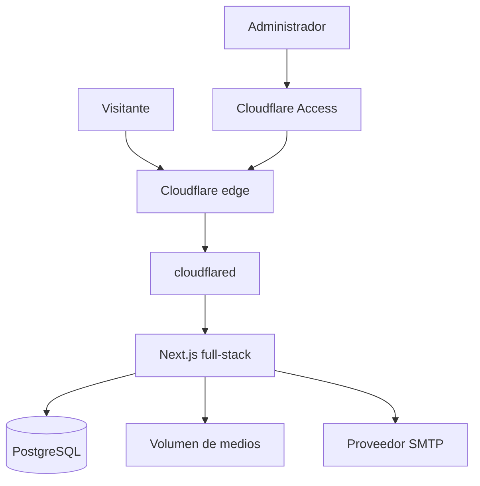
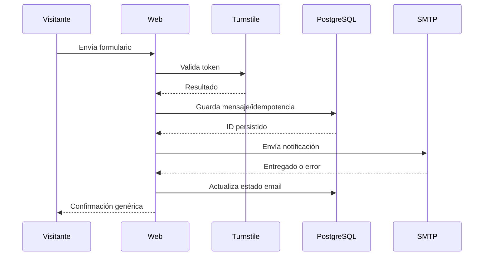

# Stack tecnológico y arquitectura

## 1. Decisión principal

Usar un monolito modular de Next.js con PostgreSQL.

Para un portfolio de un solo administrador, separar Next.js y NestJS agregaría dos imágenes, dos contratos, más superficie de ataque, más despliegues y más consumo sin aportar una necesidad real. El monolito conserva capas claras internamente y puede extraer una API en el futuro si aparece un segundo cliente o un dominio con carga propia.

## 2. Stack recomendado

Versiones de referencia al 2026-08-31:

| Capa | Elección | Motivo |
| --- | --- | --- |
| Runtime | Node.js 24 LTS | Rama LTS; Node recomienda producción sobre Active o Maintenance LTS |
| Framework | Next.js 16.3.3 o parche de seguridad posterior compatible dentro de 16.x | App Router, SSR/SEO, Route Handlers, Server Components y standalone Docker |
| UI | React compatible con Next.js 16 | Mantener la versión soportada por el framework |
| Lenguaje | TypeScript 5.x estricto | Tipado end-to-end y validación de contratos |
| CSS | Tailwind CSS 4 + CSS Modules/variables para piezas complejas | La referencia ya usa utilidades; los tokens propios evitan un resultado genérico |
| Motion | Motion para React, con CSS cuando sea suficiente | Animaciones controladas y reduced motion |
| Iconos | Lucide, subset importado | Coincide con el lenguaje visual observado |
| DB | PostgreSQL 18, siempre en minor vigente | Soporte hasta 2030 y buena relación complejidad/robustez |
| ORM | Drizzle ORM + drizzle-kit | SQL visible, esquema tipado y migraciones pequeñas |
| Validación | Zod | Esquemas compartidos entre acciones, API y formularios |
| Formularios | React Hook Form o formularios nativos + Server Actions según pantalla | UX cliente sin confiar en validación cliente |
| Password | `argon2` usando Argon2id | Recomendación OWASP para sistemas nuevos |
| Sesiones | Token opaco aleatorio, hash en DB y cookie segura | Revocación, rotación y ausencia de claims sensibles en cliente |
| Markdown | `react-markdown` + GFM + sanitización estricta; HTML crudo desactivado | Casos técnicos sin ejecutar MDX/JS |
| Código | Shiki server-side | Syntax highlighting sin gran bundle cliente |
| Imágenes | Sharp | Re-encode, variantes, dimensiones y eliminación de metadata |
| Email | SMTP mediante Nodemailer | Proveedor intercambiable; persistir antes de enviar |
| Logs | Pino JSON con redacción | Logs estructurados y livianos |
| Tests | Vitest + Testing Library + Playwright + axe + Lighthouse CI | Unidad, integración, E2E, visual y accesibilidad |
| Paquetes | pnpm con lockfile y Corepack | Instalación reproducible y workspaces |
| Contenedores | Docker/Compose, preferentemente rootless | Encaja con el servidor doméstico y reduce privilegios |
| Edge | Cloudflare Tunnel + Access + Turnstile | Sin puertos entrantes, panel identity-aware y antispam |
| Registry | GHCR por digest | Build centralizado, trazabilidad y rollback |

Next.js publicó el parche `16.3.3` como Active LTS para corregir vulnerabilidades críticas en agosto de 2026; no fijar una versión anterior. Node 24 figura como LTS, mientras que Node 20 ya está EOL. PostgreSQL mantiene cada major cinco años y recomienda ejecutar el minor vigente.

## 3. Arquitectura lógica



Reglas:

- El visitante público nunca llega directamente a la IP doméstica.
- Cloudflare Access protege `/admin/*` y `/api/admin/*`.
- `cloudflared` comparte red Docker solo con `web`.
- `db` comparte red interna solo con `web` y el job de backup/migración.
- No hay puertos de producción publicados al host.
- SMTP es salida controlada desde `web`; sus fallos no deben perder mensajes.

## 4. Capas internas

```text
app/routes
   ↓
features (projects, cases, contact, media, auth, settings)
   ↓
application services / policies
   ↓
repositories + db schema
   ↓
PostgreSQL / filesystem / SMTP
```

- Los componentes de presentación no consultan DB directamente.
- Route Handlers y Server Actions validan input, autentican y llaman servicios.
- Los servicios aplican autorización, transacciones y eventos de auditoría.
- Los repositorios encapsulan Drizzle.
- Integraciones externas usan adaptadores con timeout y retries acotados.

## 5. Renderizado y cache

- Inicio, Stack, Casos y legales: Server Components y cache/revalidation controlada.
- Detalle de caso: render server-side con invalidación al publicar.
- Contacto y panel: dinámicos, `no-store` donde haya datos personales.
- Acciones de publicación llaman `revalidatePath`/tags correspondientes.
- Media pública: URLs versionadas por hash y cache largo inmutable.
- Admin y preview: `Cache-Control: no-store`, `robots: noindex`.
- Evitar Redis en MVP: una única instancia no necesita cache distribuida.

## 6. Internacionalización

Estrategia de rutas:

| Español | Inglés |
| --- | --- |
| `/` | `/en` |
| `/stack` | `/en/stack` |
| `/casos` | `/en/cases` |
| `/casos/[slug]` | `/en/cases/[slug]` |
| `/contacto` | `/en/contact` |
| `/privacidad` | `/en/privacy` |
| `/terminos` | `/en/terms` |

Los slugs pueden ser propios por idioma y deben mapear a una misma entidad. El selector navega a la ruta equivalente; no solo cambia texto en cliente. Mantener una cookie de locale estrictamente funcional para visitas a rutas no prefijadas.

## 7. Contenido sin perder creatividad

No implementar una tabla genérica de “componentes de página” capaz de dibujar cualquier cosa. Eso diluye el diseño y abre riesgos.

Usar modelos específicos:

- `home_content`: manifesto, terminal, método, postura IA y CTA.
- `stack_layer`, `tool_group`, `principle`.
- `project` y relaciones.
- `case_study` con bloques permitidos.
- `legal_document` versionado.
- `site_setting` allowlisted.

El layout vive en código. La base de datos controla contenido, orden, visibilidad y traducción.

## 8. Contacto y email

Flujo:



- La respuesta no debe revelar si una dirección existe o si SMTP falló.
- Retries de email se ejecutan con una cola simple persistida en PostgreSQL y un worker dentro del proceso/cron controlado.
- No agregar Redis solo por una cola de bajo volumen.

## 9. Media

- Archivos originales aceptados se guardan temporalmente en `tmpfs` con límite.
- Validar tamaño, extensión, MIME y firma real.
- Decodificar y re-encodear con Sharp.
- Generar AVIF/WebP y fallback, dimensiones definidas y blur placeholder.
- Guardar fuera de `public/`, bajo un volumen dedicado.
- Servir mediante handler por ID/variante o copiar únicamente derivados seguros al directorio de publicación versionado.
- Alt text, ancho, alto, hash, owner y referencias se guardan en DB.

## 10. Docker de producción

Servicios mínimos:

| Servicio | Redes | Volúmenes | Puertos host |
| --- | --- | --- | --- |
| `web` | `edge`, `backend` | media read/write; tmpfs | Ninguno |
| `db` | `backend` internal | `postgres_data` | Ninguno |
| `cloudflared` | `edge` | secret/token read-only | Ninguno |
| `migrate` | `backend` | ninguno | Ninguno; one-shot |
| `backup` | `backend` | backup destination | Ninguno; perfil/job |

Configuración requerida:

- Imagen multi-stage con `output: "standalone"`.
- Usuario no root en la imagen.
- `read_only: true` para web/cloudflared cuando sea compatible.
- `tmpfs` para `/tmp`.
- `cap_drop: [ALL]` y agregar solo una capability si se demuestra necesaria.
- `security_opt: [no-new-privileges:true]`.
- `init: true`, healthcheck, límites de memoria/CPU y rotación de logs.
- Imágenes por digest o tag inmutable aprobado; nunca `latest`.
- Sin `privileged`, `network_mode: host`, montaje de `/`, dispositivos o `/var/run/docker.sock`.

## 11. CI/CD recomendado

### Pull request

1. Instalación frozen.
2. Lint y typecheck.
3. Unit/integration.
4. Build.
5. E2E de rutas clave.
6. Axe.
7. Visual diff.
8. Dependency review y CodeQL.

### Release

1. Build multi-arch solo si el servidor lo necesita; por defecto `linux/amd64`.
2. Scan de imagen.
3. SBOM.
4. Publicación en GHCR.
5. Attestation de procedencia.
6. Registrar digest de release.

### Deploy doméstico

- No usar un GitHub self-hosted runner con Docker socket en el mismo servidor.
- El servidor realiza pull de una imagen aprobada por digest.
- Verifica attestation/digest, ejecuta backup, migración compatible, healthcheck y switch.
- Mantiene el digest anterior para rollback.
- La promoción a producción requiere aprobación manual.

## 12. Observabilidad

- `/api/health/live`: proceso vivo, sin consultas externas costosas.
- `/api/health/ready`: DB y directorio de medios disponibles.
- Logs JSON con request ID, status, duración y códigos de evento.
- Redacción de email, password, cookie, token, authorization, Turnstile y cuerpos.
- Métricas mínimas: latencia, errores 5xx, mensajes persistidos, SMTP fallido, login fallido, espacio de disco y antigüedad de último backup.
- Alertas solo para estado accionable.

## 13. Decisiones descartadas

| Alternativa | Motivo de descarte |
| --- | --- |
| NestJS separado | Complejidad y superficie operativa innecesarias para un único frontend/admin |
| SQLite | PostgreSQL ofrece mejores constraints, concurrencia, backups y crecimiento sin costo significativo en este host |
| Supabase/servicio gestionado | Contradice el objetivo principal de autohosting y agrega dependencia; puede reconsiderarse si operación pesa más que control |
| Redis | No hay escala multiinstancia ni carga que lo justifique en MVP |
| Kubernetes | Exceso operativo para una PC y un único producto |
| Page builder | Perdería identidad, complicaría i18n y aumentaría riesgo XSS |
| MDX desde admin | Permite ejecución; Markdown/bloques seguros cubren el caso |
| Watchtower auto-update | Actualizaciones sin gate pueden romper DB/app y dificultar rollback |

## 14. Fuentes técnicas

- [Next.js: self-hosting](https://nextjs.org/docs/app/guides/self-hosting)
- [Next.js: standalone Docker deployment](https://nextjs.org/docs/app/getting-started/deploying)
- [Next.js: parche de seguridad de agosto de 2026](https://nextjs.org/blog/august-2026-security-release)
- [Node.js: ramas y estado LTS](https://nodejs.org/en/about/previous-releases)
- [PostgreSQL: versionado y soporte](https://www.postgresql.org/support/versioning/)
- [Cloudflare Tunnel](https://developers.cloudflare.com/cloudflare-one/networks/connectors/cloudflare-tunnel/)
- [Cloudflare Access: application paths](https://developers.cloudflare.com/cloudflare-one/access-controls/policies/app-paths/)
- [Cloudflare Turnstile: validación server-side](https://developers.cloudflare.com/turnstile/get-started/server-side-validation/)
- [Docker: rootless mode](https://docs.docker.com/engine/security/rootless/)
- [Docker Compose: secrets](https://docs.docker.com/compose/how-tos/use-secrets/)
- [Web Vitals](https://web.dev/articles/vitals)
