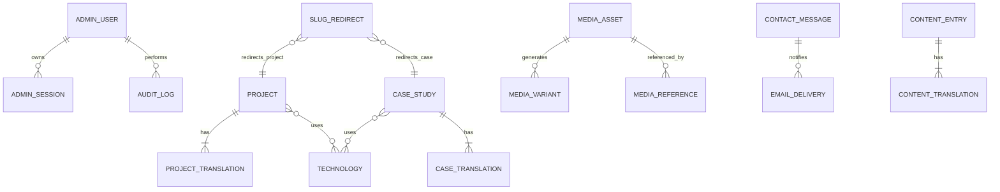

# Modelo de datos y contratos de API

## 1. Convenciones

- UUIDv7 o UUID aleatorio para IDs; no exponer secuencias.
- Timestamps UTC: `created_at`, `updated_at`, `published_at`, `deleted_at` cuando aplique.
- Soft delete para contenido y medios; hard delete solo por job/acción confirmada.
- Slugs normalizados y únicos.
- Estados de contenido: `draft`, `review`, `published`, `archived`.
- Traducciones en tablas relacionadas, no columnas JSON sin constraints para todo el modelo.
- JSONB solo para bloques estructurados allowlisted y metadata no crítica.
- Todas las mutaciones relevantes escriben `audit_log` en la misma transacción.

## 2. Diagrama de entidades



Las dos relaciones de `SLUG_REDIRECT` son conceptuales; en SQL se implementan con `entity_type + entity_id` y validación de aplicación, o tablas separadas para mantener integridad referencial estricta.

## 3. Tablas

### `admin_user`

| Campo | Tipo | Regla |
| --- | --- | --- |
| `id` | uuid | PK |
| `email` | citext/text normalizado | unique, no public registration |
| `password_hash` | text | Argon2id |
| `display_name` | text | 2–80 |
| `status` | enum | active, locked, disabled |
| `failed_login_count` | int | no negativo |
| `locked_until` | timestamptz nullable | cooldown |
| `password_changed_at` | timestamptz | revoca sesiones anteriores |
| timestamps | timestamptz | UTC |

No guardar password hint, respuestas de seguridad ni tokens reversibles.

### `admin_session`

| Campo | Tipo | Regla |
| --- | --- | --- |
| `id` | uuid | PK |
| `user_id` | uuid | FK cascade/restrict según política |
| `token_hash` | bytea/text | unique; nunca guardar token plano |
| `created_at` | timestamptz | |
| `last_seen_at` | timestamptz | actualización acotada |
| `expires_at` | timestamptz | máximo absoluto |
| `idle_expires_at` | timestamptz | 30 min por defecto |
| `revoked_at` | timestamptz nullable | |
| `ip_prefix_hash` | text nullable | señal de auditoría, no bloqueo rígido |
| `user_agent_summary` | text nullable | sin string completo si no es necesario |

### `project`

| Campo | Tipo | Regla |
| --- | --- | --- |
| `id` | uuid | PK |
| `status` | enum | draft/review/published/archived |
| `kind` | enum | production, prototype, personal, concept |
| `featured` | boolean | default false |
| `sort_order` | int | index |
| `metric_value` | text nullable | solo si verificada |
| `metric_label_key` | text nullable | label traducible |
| `repo_url`, `live_url` | text nullable | https allowlist |
| `evidence_note` | text nullable | solo admin |
| `published_at` | timestamptz nullable | |
| `deleted_at` | timestamptz nullable | |

### `project_translation`

| Campo | Tipo | Regla |
| --- | --- | --- |
| `project_id` | uuid | FK |
| `locale` | enum | es/en |
| `slug` | text | unique por locale |
| `title` | text | 3–140 |
| `summary` | text | 20–500 |
| `category` | text | 2–80 |
| `role` | text nullable | |
| `body` | jsonb nullable | bloques allowlisted |
| `seo_title` | text nullable | |
| `seo_description` | text nullable | |

PK compuesta `project_id + locale`.

### `case_study`

Campos base: `id`, `status`, `sort_order`, `read_time_minutes`, `cover_media_id`, `result_value`, `result_verified`, `published_at`, `deleted_at`, timestamps.

### `case_translation`

Campos: `case_id`, `locale`, `slug`, `title`, `dek`, `category`, `period_label`, `result_label`, `content_blocks`, `seo_title`, `seo_description`.

`content_blocks` acepta exclusivamente:

- `heading`: nivel 2–4 y texto.
- `paragraph`: Markdown seguro sin HTML.
- `list`: ordenada/no ordenada e items.
- `quote`: texto y atribución opcional.
- `code`: lenguaje allowlisted, código y caption.
- `image`: `media_id`, alt por locale y caption.
- `gallery`: IDs de media y layout permitido.
- `metric`: valor, label y evidencia interna.
- `callout`: tipo allowlisted y texto.
- `diagram`: Mermaid solo si se renderiza server-side/sandbox con esquema allowlisted; si no, usar imagen derivada.

No aceptar nombres de componente, JSX, imports, scripts, estilos inline ni URLs HTML.

### `technology`

`id`, `key`, `label`, `category`, `sort_order`, `active`. Relaciones many-to-many `project_technology` y `case_technology`.

### `media_asset`

| Campo | Tipo | Regla |
| --- | --- | --- |
| `id` | uuid | PK |
| `storage_key` | text | aleatorio, unique |
| `original_name_safe` | text | solo metadata |
| `media_type` | enum | image |
| `detected_mime` | text | allowlist |
| `size_bytes` | bigint | límite |
| `width`, `height` | int | límites |
| `sha256` | text | deduplicación/integridad |
| `alt_es`, `alt_en` | text | requeridos para publicar |
| `caption_es`, `caption_en` | text nullable | |
| `status` | enum | processing, ready, quarantined, trashed |
| `uploaded_by` | uuid | FK admin |
| `deleted_at` | timestamptz nullable | |

### `media_variant`

`id`, `asset_id`, `format`, `width`, `height`, `storage_key`, `size_bytes`, `sha256`. Unique por `asset_id + format + width`.

### `media_reference`

`asset_id`, `entity_type`, `entity_id`, `field_path`. Permite bloquear eliminación y mostrar usos.

### `contact_message`

| Campo | Tipo | Regla |
| --- | --- | --- |
| `id` | uuid | PK |
| `idempotency_hash` | text | unique, TTL lógico |
| `name` | text | 2–80 |
| `email_normalized` | text | máximo 254 |
| `company_role` | text nullable | máximo 120 |
| `scope` | enum | opciones de UI |
| `budget` | enum | opciones de UI |
| `message` | text | 20–2000 |
| `locale` | enum | es/en |
| `consent_at` | timestamptz | requerido |
| `status` | enum | new, read, replied, archived, spam |
| `turnstile_outcome` | enum | success/fail/error, sin token |
| `source_ip_hash` | text nullable | HMAC rotado; no IP plana |
| `retention_until` | timestamptz | por defecto +24 meses |
| timestamps | timestamptz | |

El email y mensaje son PII. Excluirlos de logs, métricas y audit diffs.

### `email_delivery`

`id`, `contact_message_id`, `kind`, `status`, `attempt_count`, `next_attempt_at`, `last_error_code`, `sent_at`, timestamps. El error se normaliza; no guardar respuesta SMTP completa si contiene PII.

### `content_entry` / `content_translation`

Para textos fijos con esquema conocido:

- `content_entry`: `id`, `key`, `schema_version`, `status`, timestamps.
- `content_translation`: `entry_id`, `locale`, `payload` validado por un esquema Zod específico para `key`.

Claves permitidas iniciales: `home`, `stack`, `contact`, `privacy`, `terms`.

### `site_setting`

Key/value allowlisted para datos no secretos: email público, LinkedIn, GitHub, ubicación, zona horaria, disponibilidad, flags editoriales. Cada key tiene tipo y validación. No usarlo como almacén genérico de secretos.

### `slug_redirect`

`id`, `entity_type`, `entity_id`, `locale`, `old_slug`, `new_slug`, timestamps. Unique por `locale + entity_type + old_slug`.

### `audit_log`

`id`, `actor_user_id`, `action`, `entity_type`, `entity_id`, `result`, `request_id`, `changes_redacted`, `created_at`. Append-only para la aplicación.

## 4. Índices mínimos

- Contenido: `(status, published_at)`, `(featured, sort_order)` y `deleted_at` parcial.
- Slugs: unique `(locale, slug)`.
- Contacto: `(status, created_at desc)`, `retention_until`, `email_normalized` solo para búsqueda administrativa.
- Sesión: unique `token_hash`, `(user_id, revoked_at)`, `expires_at`.
- Auditoría: `(created_at desc)`, `(entity_type, entity_id)` y `(actor_user_id, created_at desc)`.
- Email queue: `(status, next_attempt_at)`.

## 5. Contratos públicos

No es necesario exponer una API REST para páginas renderizadas en servidor. Los siguientes Route Handlers cubren integraciones y formularios.

| Método | Ruta | Auth | Función |
| --- | --- | --- | --- |
| `POST` | `/api/contact` | Público + Turnstile | Crear mensaje idempotente |
| `GET` | `/api/media/[id]/[variant]` | Público si publicado | Entregar derivado seguro |
| `GET` | `/api/health/live` | Público sin detalles | Liveness |
| `GET` | `/api/health/ready` | Restringible en Cloudflare | Readiness sin secretos |

Respuesta de contacto:

```json
{
  "ok": true,
  "message": "Mensaje recibido"
}
```

Errores usan códigos estables (`VALIDATION_ERROR`, `RATE_LIMITED`, `UNAVAILABLE`) y mensajes traducibles. Nunca devuelven stack, query, SMTP error ni evaluación detallada de spam.

## 6. Contratos admin

Se pueden implementar con Server Actions o Route Handlers. En ambos casos se aplican auth, autorización, CSRF/origin check, Zod y auditoría.

| Método | Ruta conceptual | Función |
| --- | --- | --- |
| `POST` | `/api/admin/auth/login` | Login y creación de sesión |
| `POST` | `/api/admin/auth/logout` | Revocar sesión actual |
| `DELETE` | `/api/admin/auth/sessions` | Revocar todas las sesiones |
| `GET/POST` | `/api/admin/projects` | Listar/crear |
| `GET/PATCH/DELETE` | `/api/admin/projects/[id]` | Ver/editar/papelera |
| `POST` | `/api/admin/projects/[id]/publish` | Validar y publicar |
| `GET/POST` | `/api/admin/cases` | Listar/crear |
| `GET/PATCH/DELETE` | `/api/admin/cases/[id]` | Ver/editar/papelera |
| `POST` | `/api/admin/cases/[id]/publish` | Validar y publicar |
| `GET/POST` | `/api/admin/media` | Listar/subir |
| `DELETE` | `/api/admin/media/[id]` | Papelera si no hay refs |
| `GET/PATCH` | `/api/admin/messages` | Listar/actualizar estados |
| `GET` | `/api/admin/messages/[id]` | Detalle |
| `GET/PATCH` | `/api/admin/content/[key]` | Editar secciones fijas |
| `GET/PATCH` | `/api/admin/settings` | Ajustes allowlisted |
| `GET` | `/api/admin/audit` | Consultar auditoría |

No admitir mass assignment. Cada handler construye el objeto persistible desde campos allowlisted.

## 7. Autorización

MVP tiene un rol `owner`. Aun así, centralizar políticas:

- `canReadAdmin`.
- `canMutateContent`.
- `canPublish`.
- `canManageSecurity`.
- `canExportMessages`.

Esto evita dispersar checks y permite sumar `editor` sin reescribir todo.

## 8. Transacciones

Usar transacción para:

- Crear/editar contenido + traducciones + tecnologías + auditoría.
- Publicar + snapshot/redirect + auditoría.
- Crear mensaje + delivery pendiente.
- Marcar/eliminar medios + referencias.
- Cambiar password + revocar sesiones + auditoría.

El envío SMTP ocurre después del commit. La cola persiste el intento.

## 9. Retención y jobs

- Sesiones vencidas: limpieza diaria.
- Mensajes superando `retention_until`: lista de revisión o borrado automático configurable.
- Medios en papelera no referenciados: purga tras 30 días.
- Email fallido: backoff acotado; luego `dead` y alerta.
- Audit log: mínimo 12 meses para acciones admin; revisar espacio.
- Backups: fuera del modelo de jobs de la app, gestionados por infraestructura.

## 10. Seed y migración

- `seed:dev` carga contenido ficticio claramente marcado.
- `seed:prod` solo crea cuenta bootstrap desde input secreto y settings mínimos; no publica proyectos.
- La contraseña no se acepta por argumento CLI que quede en historial; leer desde TTY segura o secret file.
- Todas las migraciones deben ser forward-compatible con el release anterior cuando sea posible.
- Prohibido ejecutar `push` de esquema directo en producción; solo migraciones revisadas.
